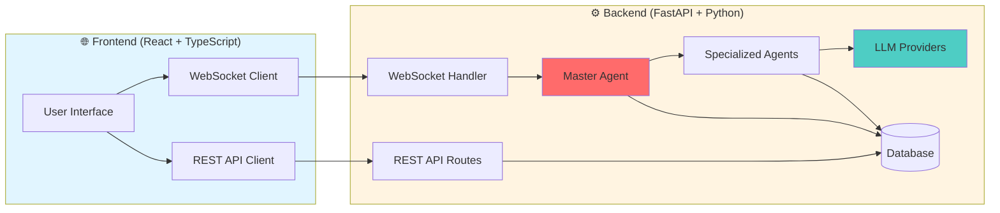
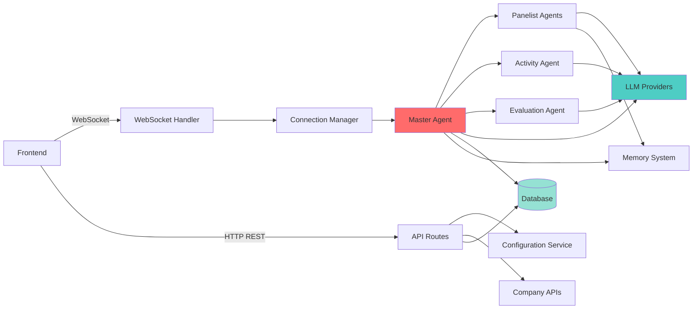
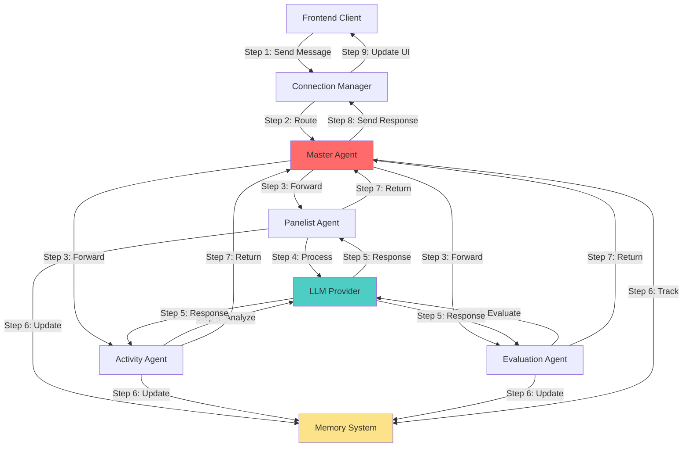
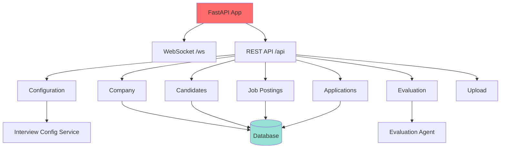
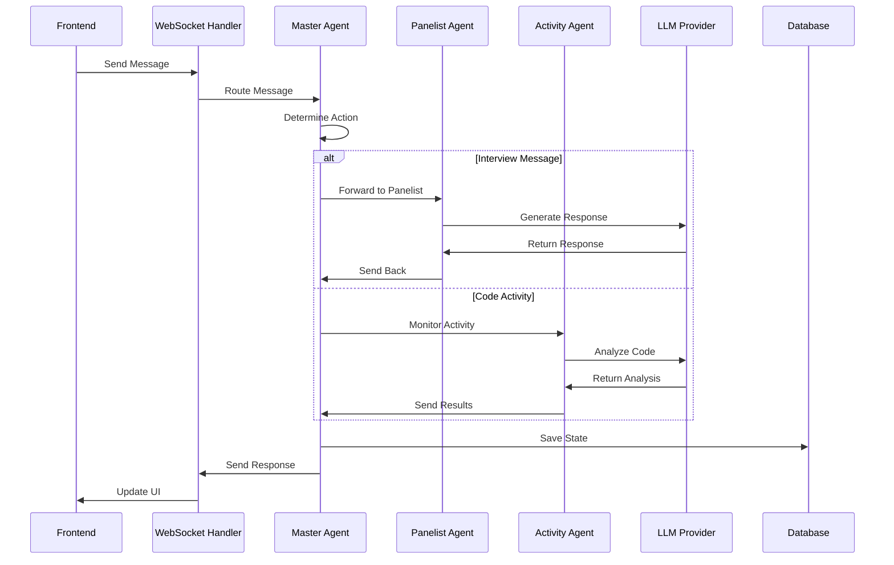
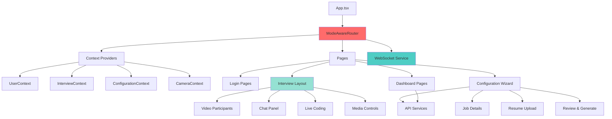
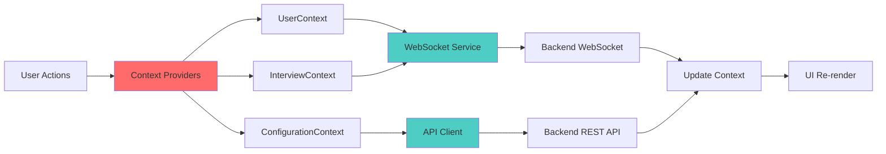
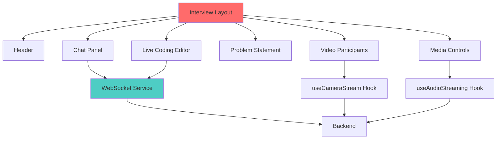

# Architecture Documentation

This document describes the architecture of the AI Interview Simulation Platform, including both backend and frontend components.

## System Overview



## Backend Architecture

The backend is built with Python FastAPI and follows an agent-based architecture with a master agent orchestrating multiple specialized agents.

### High-Level Architecture



### Agent Communication Flow



### API Routes Structure



### Backend Component Details

#### **Master Agent** (Central Orchestrator)
- Manages interview flow and state
- Routes messages between agents and frontend
- Determines who speaks next
- Generates advice for panelists
- Performs topic completion checks
- Maintains interview transcript

#### **Specialized Agents**
- **Panelist Agents**: AI interviewers with unique personalities
  - Think → Access Domain Knowledge → Respond → Reflect → Evaluate
  - Multiple panelists per interview round
- **Activity Agent**: Monitors coding activities
  - Analyzes code changes in real-time
  - Provides insights to panelists
- **Evaluation Agent**: Performs scoring and assessment
  - Evaluates candidate responses
  - Generates comprehensive feedback

#### **Core Services**
- **Database Layer**: Abstracted database interface
  - Supports Firebase, PostgreSQL, SQLite
  - User profiles, sessions, configurations
- **LLM Providers**: Multi-provider AI support
  - OpenAI (GPT-4, GPT-3.5)
  - DeepSeek, Gemini, Grok, Perplexity
- **Speech Services**: Text-to-speech and speech-to-text
  - OpenAI, ElevenLabs, Google, Groq
- **Memory System**: Context and character memory
  - Character memory for panelist personalities
  - Recall memory for interview context
  - Graph-based memory structure

#### **Communication Flow**



## Frontend Architecture

The frontend is a React TypeScript application with mode-aware routing and real-time WebSocket communication.

### Component Hierarchy



### State Management Flow



### Interview Page Structure



### Frontend Component Details

#### **Three-Mode Architecture**
1. **Candidate Practice Mode** (`candidate-practice`)
   - Full signup and registration
   - Practice interview scenarios
   - Skill development features
   - Resume upload and profile management

2. **Company Interviewing Mode** (`company-interviewing`)
   - Company dashboard
   - Interview configuration
   - Candidate management
   - Analytics and reporting

3. **Company Candidate Interview Mode** (`company-candidate-interview`)
   - Streamlined interview experience
   - Interview code login (no signup required)
   - Focused interview interface

#### **State Management**
- **Context API**: Global state management
  - `UserContext`: Current user and authentication
  - `InterviewContext`: Interview state and participants
  - `ConfigurationContext`: Interview configuration data
  - `CameraContext`: Camera/media state
  - `CompanyContext`: Company-specific data
  - `CompanyCandidateContext`: Company candidate flow

#### **Real-Time Communication**
- **WebSocket Service**: Bidirectional communication
  - Interview messages
  - Speech transcription
  - Real-time updates
  - Activity monitoring

#### **Key Features**
- Mode-aware routing with feature flags
- Protected routes with authentication
- Real-time video/audio streaming
- Live coding environment integration
- Responsive UI with Tailwind CSS
- shadcn/ui component library

### Data Flow

#### **Interview Flow**
```
1. User Login → UserContext
2. Load Configuration → ConfigurationContext
3. Start Interview → InterviewContext
4. WebSocket Connection → Real-time updates
5. Video/Audio Stream → CameraContext
6. Messages → Chat Panel
7. Evaluation → Results Page
```

#### **Configuration Flow**
```
1. Job Details Input
2. Resume Upload
3. Configuration Generation (API)
4. Review & Generate
5. Save Configuration
6. Start Interview
```

## Technology Stack

### Backend
- **Framework**: FastAPI
- **Language**: Python 3.9+
- **Database**: Firebase / PostgreSQL / SQLite
- **Real-time**: WebSocket
- **AI**: OpenAI, DeepSeek, Gemini, Grok
- **Speech**: OpenAI, ElevenLabs, Google, Groq
- **Testing**: pytest

### Frontend
- **Framework**: React 18
- **Language**: TypeScript
- **Build Tool**: Vite
- **Styling**: Tailwind CSS
- **Components**: shadcn/ui
- **Routing**: Wouter
- **State**: React Context API
- **Real-time**: WebSocket

## Communication Patterns

### WebSocket Message Types

**From Client:**
- User Login/Logout
- Speech Data (STT)
- Text Messages
- Interview Start/End
- Configuration Requests

**To Client:**
- Interview Messages
- Speaker Changes
- Topic Updates
- Activity Info
- Evaluation Results
- Speech Audio (TTS)

### REST API Endpoints

- `/api/configurations/*` - Interview configuration CRUD
- `/api/company/*` - Company management
- `/api/candidates/*` - Candidate management
- `/api/job-postings/*` - Job posting management
- `/api/applications/*` - Application tracking
- `/api/evaluation/*` - Evaluation data
- `/api/upload/*` - File uploads

